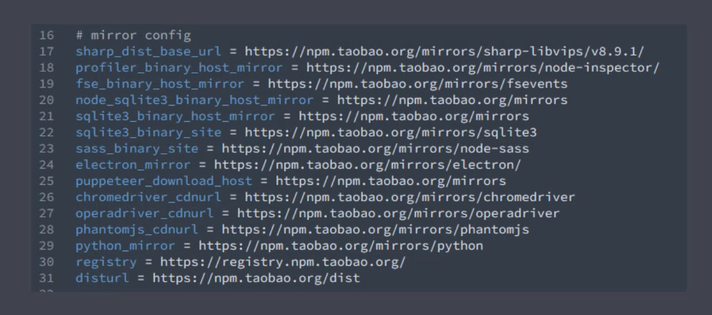

# 脚手架工具
##### 前端工程化的发起者
##### 脚手架的本质作用：创建项目基础结构、提供项目规范和约定
+ 相同的组织结构
+ 相同的开发范式
+ 相同的模块依赖
+ 相同的工具配置
+ 相同的基础代码
##### 例子：IDE创建项目的过程就是一个脚手架的工作流程
##### 前端脚手架：由于前端技术选型多样，也没有一个统一的标准，所以前端的脚手架一般不会集成于某个IDE中，而是以一个独立的工具存在，而且相对会复杂一些
##### 脚手架的目标：解决项目创建中的复杂工作
+ 内容概要
  + 脚手架的作用
  + 常用的脚手架工具
  + 通用脚手架工具剖析
  + 开发一款脚手架
### 常用的脚手架工具
#### 市面上大多脚手架工具都是为特定项目服务的，例如：React项目->create-react-app，Vue项目->vue-cli,Angular项目->angular-cli
##### 实现方式：根据信息创建对应的项目基础结构，一般只适用于自身的框架
#### Yeoman 通用型脚手架，根据一套模板生成对应的结构，很灵活、容易扩展
#### Plop 创建特殊类型文件，例如：创建一个组件/模板所需要的文件，这些文件一般是由几个特定的文件组成的，每个文件都有特定的代码结构
##### 重点关注几个有代表性的工具
## Yeoman 用以创造现代化web应用的脚手架工具
+ 优点：不同于Vue-cli这种脚手架工具，yeoman更像是一种运行平台，可以搭配generator创造任何类型的平台，可以创建自定义的generator来创造自定义的平台
+ 缺点：在专注于框架开发的开发者眼中，yeoman过于通用，不够专注
### Yeoman 基本使用
+ 在全局范围安装yo：npm i yo -g
+ 安装对应的generator：npm i generator-node -g (node模块)
+ 通过yo运行generator：yo node (去掉generator前缀)
+ 填写相关信息
  + 项目名
  + 该模块在npm上已存在，是否要更换
  + 项目描述
  + 项目主页
  + 作者、Email
  + 模块关键词
  + 代码覆盖率报告发送地址
  + node支持的版本
  + 作者id
  + 项目结构 (MIT)
### Sub Generator
##### 不需要创建完整的项目结构，只需要在已有的文件内创建特定类型的文件，可以使用Generator提供的Sub Generator
+ 生成Sub Generator cli 文件：yo node:cli  使模块变成cli应用
  + 是否重写package.json文件
+ package.json中添加了新的cli模块
+ lib/_tests_中添加了新的cli文件
+ 这个模块就可以作为全局的命令模块使用
+ <文件名> --help 可以打印 lib/_tests_中的cli文件
+ 这个是Generator的子集的Generator特性
+ 注意：并不是每个Generator都提供子集的生成器，使用前需要通过所使用Generator的官方文档来明确这个Generator下有没有子集的生成器
### Yeoman 常规使用总结
1. 明确你的需求
2. 找到合适的Generator
3. 全局范围安装找到的Generator
4. 通过Yo运行对应的Generator
5. 通过命令行交互填写选项
6. 生成你所需要的项目结构
+ 淘宝镜像加速

### 自定义Generator
##### 基于Yeoman搭建自己的脚手架
### 创建Generator模块
##### Generator本质上就是一个NPM模块
##### Generator 需要有特定的基本结构
+ generator      生成器目录
  + app          默认生成器目录
    + index.js   默认生成器实现
+ package.json   模块包配置文件

##### 带有component的子生成器
+ generator      生成器目录
  + app          默认生成器目录
    + index.js   默认生成器实现
  + component    其他生成器目录
    + index.js   其他生成器实现
+ package.json   模块包配置文件

+ 模块名称必须由generator-<name>的格式
1. 创建名为generator-<name>的文件夹
2. 命令行添加yeoman-generator： npm add teoman-generator
3. 创建默认生成器目录 generator-<name>/generators/app/index.js
4. 在index.js中实现
5. 通过npm link 将生成器文件添加到全局
6. 在其他文件夹通过yo <name> 的方式添加文件

### 根据模板创建文件
+ 在 generator-<name>/generators/app/templates 文件夹下创建模板文件
+ 模板文件指出EJS语法
+ generators/app/index.js对模板文件进行处理并输出
##### 相对于手动创建每一个文件，模板的方式大大提高了效率
### 接收用户输入数据
+ 使用 prompting 方法接收用户输入的数据，并返回一个 prompt ，是一个promise对象
+ prompt 接收一个数组，数组中包含对象，对象中存在一些与用户之间的交流
+ type：输入类型，name：最终结果的键，message：给用户的提示，default：this.addname：为项目生成目录名称
+ 添加then回调接收一个answers用户输入的结果：answers => {name: 'user input value'}
+ 将值挂载到对象上 this.answers = answers
+ 将值作为模板数据上下文的数据进行输出
### Vue Generator 案例
+ 创建新的模板文件，将所需要的模板添加到templates文件夹中
+ 使用数组保存所有文件名，遍历生成到目标文件中
+ 若要不转义直接输出EJS，则在<%后再加一个%
### 发布 Generator
##### Generator实际上就是一个npm模块，发布Generator就是发布npm模块
+ 将本地代码保存到git仓库
+ 使用 npm publish提交发布
### Plop 小型的脚手架工具
##### 主要用于创建项目中某种类型的文件
### Plop的基本使用
+ 将plop模块作为项目开发依赖安装：npm add plop -dev
+ 在项目根目录下创建一个plopfile.js文件
+ 在plopfile.js文件中定义脚手架任务
+ 编写用于生成特定类型文件的模板 ： plop-templates/
+ 通过Plop提供的cli运行脚手架工具： plop <name>
### 脚手架的工作原理
##### 脚手架实际上是一个node的cli应用，创建脚手架就是创建一个cli应用
+ 初始化一个package.json文件
+ 往package.json文件添加一个bin字段入口文件
+ 添加入口文件
+ 将入口文件添加到全局： npm link
+ 在控制台执行创建文件的文件名就能执行里头的指令
+ 安装 inquirer 模块用于用户交互
+ 新建模板文件夹作为模板
+ 根据用户回答的结果生成文件

